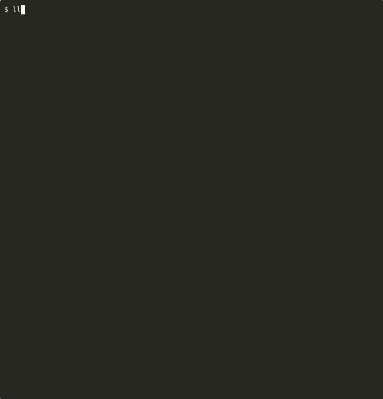

# llm-server

Smart launcher for [ik_llama.cpp](https://github.com/ikawrakow/ik_llama.cpp) and [llama.cpp](https://github.com/ggml-org/llama.cpp). Auto-detects your hardware, figures out the optimal configuration, and launches the server — no manual flag tuning required.

```bash
llm-server unsloth/Qwen3.5-27B-GGUF --download
```



## Features

- **Smart Setup** — No manual configuration needed. Creates model directories automatically on first run.
- **Built-in GGUF Downloader** — Use `--download` with any HuggingFace repo. Automatically recommends the best quantization based on your total VRAM and System RAM.
- **Smart Switcher** — Auto-detects fused `ffn_up_gate` tensors and switches to mainline `llama.cpp` to prevent `ik_llama.cpp` crashes.
- **Lib Hub** — Automatically symlinks all required `.so` libraries into a temporary directory, solving library path issues.
- **Split Mode Graph** — Automatically enables `-sm graph` for both `ik_llama.cpp` and mainline for superior multi-GPU scaling.
- **Heterogeneous GPU support** — different VRAM sizes, different PCIe bandwidths, properly weighted.
- **MoE expert auto-placement** — starts conservative, measures actual VRAM usage, optimizes, caches for instant next startup.
- **Benchmark mode** — `--benchmark` to measure tok/s and auto-exit after completion.

## Install

```bash
git clone https://github.com/raketenkater/llm-server.git
cd llm-server
./install.sh
```

### Requirements

- [ik_llama.cpp](https://github.com/ikawrakow/ik_llama.cpp) (recommended) or [llama.cpp](https://github.com/ggml-org/llama.cpp) built with CUDA
- `nvidia-smi` (for GPU detection)
- `python3` (for GGUF metadata parsing and downloading)
- `huggingface_hub` and `tqdm` (required for `--download` feature)
- `curl` (for health checks and benchmarks)

## Usage

```bash
# Basic — auto-detects everything
llm-server model.gguf

# Help — show all available flags
llm-server -h

# Interactive Download & Recommend — specify any HuggingFace repository
llm-server unsloth/Qwen3.5-27B-GGUF --download

# Force a specific backend
llm-server --server-bin /path/to/llama-server model.gguf

# Start and run a quick benchmark (auto-exits)
llm-server --benchmark model.gguf
```

## How It Works

### The Smart Downloader
When you use `--download`, the script calculates your total available memory:
`Total = System VRAM + System RAM`
It then looks at the model repository and recommends the quantization level that will give you the best balance of speed and quality for your specific hardware.

### The Lib Hub
Fixes the "missing library" issue by dynamically finding all `.so` files in your build directory and linking them into a temporary search path. This ensures `llama-server` always has its helper libraries, even in complex or custom build environments.

## License
MIT
